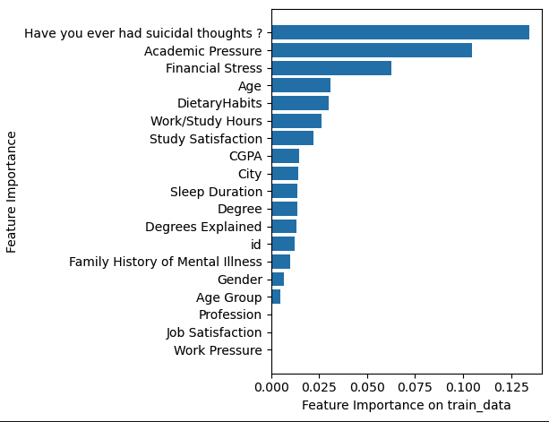
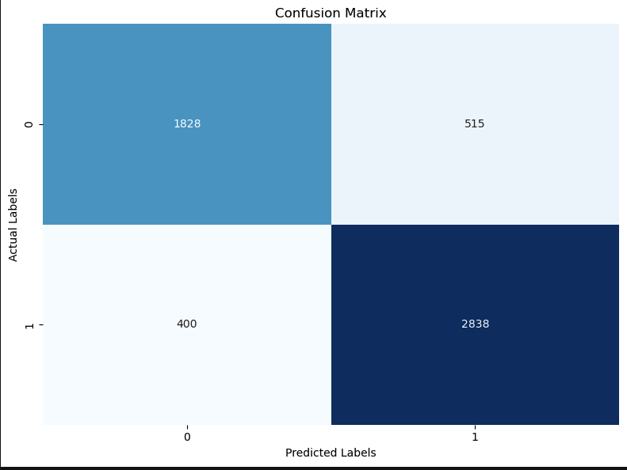

# Mental Health Prediction Using Machine Learning

A machine learning project using **AutoGluon** to predict depression based on mental health survey data. The goal is to leverage automated ML to:

* Identify key features affecting mental health
* Evaluate and compare predictive models
* Optimize for accuracy and interpretability

---

## Dataset

**Source:** \[Kaggle.com]
This dataset includes various psychological and demographic features.

* **Task:** Binary classification — Predict if an individual is likely to experience depression
* **Target Feature:** `Depression`
* **Size:** 27,901 rows × 20 columns
* **Features Include:**

  * Age
  * Gender
  * Academic Pressure
  * Financial Stress
  * Suicidal Thoughts
  * Sleep Quality
  * Exercise
  * Dietary Habits

---

## Features

*  **Data Visualization:** Heatmaps, bar plots, and confusion matrix
*  **Feature Engineering:** Handling missing values, encoding categorical features
*  **AutoML with AutoGluon:** Fast training, hyperparameter tuning, and model selection
*  **Model Evaluation:**

  * Accuracy
  * Feature importance
  * Leaderboard comparison
*  **Confusion Matrix:** Visual check of prediction performance

---

##  How to Run

1. **Clone this repo:**

   ```bash
   git clone https://github.com/yourusername/Mentalhealth_ML.git
   cd Mentalhealth_ML
   ```

2. **Install dependencies:**

   ```bash
   pip install -r requirements.txt
   ```

3. **Run the notebook:**

   * Open `Mentalhealth_ML.ipynb` in Jupyter or VSCode
   * Run all cells step by step

---

##  Key Outcomes

*  **Accuracy:** \~90%
*  **Most Important Features:**

  * Suicidal Thoughts
  * Academic Pressure
  * Financial Stress
  * Age
  * Dietary Habits

---

##  Visualizations

*  **Feature Importance:**
  

*  **Confusion Matrix:**
  

---

##  Future Improvements

* Improve feature engineering using external datasets (e.g., clinical, behavioral)
* Apply Explainable AI techniques (e.g., SHAP) for transparency
* Deploy as an API or interactive web application

---

##  Requirements

```
autogluon
scikit-learn
pandas
matplotlib
seaborn
jupyterlab
```

You can install everything using:

```bash
pip install -r requirements.txt
```

---

##  Author

**Mary Eyeson**
Data Analysis & Machine Learning Enthusiast
 Dallas, TX

---
